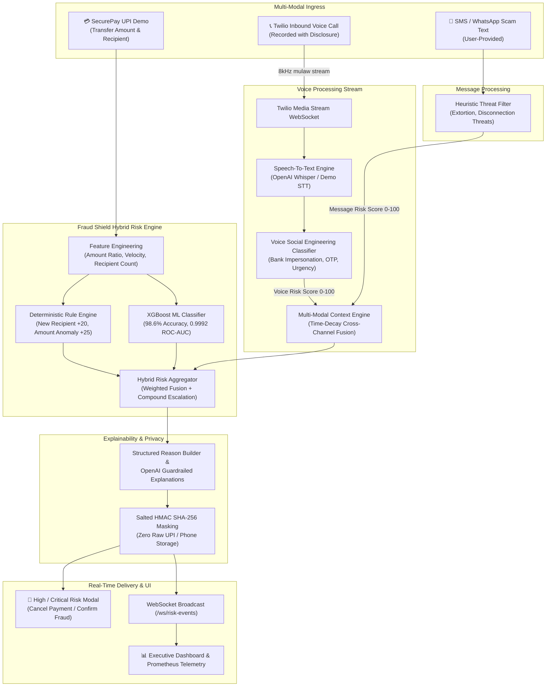

# Fraud Shield 🛡️
### Privacy-Conscious, Explainable Real-Time Fraud Prevention Platform

[](https://www.python.org/downloads/)
[](https://fastapi.tiangolo.com)
[](https://react.dev)
[](https://xgboost.readthedocs.io)
[](https://opensource.org/licenses/MIT)

---

## 📌 Important Hackathon Prototype Notice
> **DISCLAIMER:**  
> This application is a **controlled hackathon prototype and research demonstration**.
> - It does **NOT** connect directly to NPCI, PhonePe, Google Pay, or live banking databases.
> - It does **NOT** bypass Android security sandbox or intercept third-party application network traffic.
> - All payments are simulated in the controlled **SecurePay UPI Demo** environment.
> - Live voice analysis uses **Twilio Programmable Voice** and **Twilio Media Streams** with explicit call recording/analysis disclosures and configurable consent.
> - Fraud scores are probabilistic risk estimates, not definitive legal proof of fraud. No UPI PIN, password, or banking credentials should ever be entered into the platform.

---

## 📖 Problem Statement
UPI and instant digital payment systems in India have experienced explosive adoption, accompanied by a surge in sophisticated multi-channel cyber fraud:
1. **Voice Phishing (Vishing):** Impersonators pose as bank security officers or police officials creating artificial panic and coercing victims to transfer money or share OTPs.
2. **Social Engineering & Smishing:** Urgent SMS / WhatsApp messages threatening power disconnections, KYC expirations, or lottery lures.
3. **Cross-Channel Temporal Attacks:** Scammers initiate a voice call right before prompting the victim to execute a high-value transfer to an unverified mule account.
4. **Lack of Explainability:** Traditional banking anti-fraud engines act as black boxes with high false-alarm rates that frustrate users.

**Fraud Shield** solves this by fusing **deterministic heuristic rules**, **XGBoost machine learning**, **temporal multi-modal context correlation**, and **natural language explainability** to protect users in real-time.

---

## 🏗️ System Architecture



---

## ⚡ Tech Stack

| Layer | Technologies |
|---|---|
| **Frontend** | React 18, TypeScript, Vite, Tailwind CSS, Lucide Icons, Recharts, React Router v6 |
| **Backend** | Python 3.12+, FastAPI, Pydantic v2, SQLAlchemy 2.0, Alembic, WebSockets, Uvicorn |
| **Database** | PostgreSQL 16 (Production/Docker) / SQLite (Standalone Local) |
| **Machine Learning** | XGBoost 3.4, scikit-learn, pandas, numpy, joblib |
| **Voice & Speech** | Twilio Programmable Voice, Twilio Media Streams, OpenAI Whisper API / Demo STT Fallback |
| **Explainable AI** | OpenAI GPT-4o-mini (Strict Guardrails) + Deterministic Template Engine Fallback |
| **Monitoring** | Prometheus (`/metrics`), Grafana dashboards (Latency, Inferences, WebSocket clients) |
| **Infrastructure** | Docker, Docker Compose, AWS ECS Fargate, AWS RDS PostgreSQL, Vercel |

---

## 🚀 Quick Start (Local Development)

### Prerequisites
- Python 3.12+ (Python 3.14 compatible)
- Node.js 18+ & npm
- Git

### 1. Clone & Configure
```bash
git clone https://github.com/your-username/fraud-shield.git
cd fraud-shield
cp .env.example .env
```

### 2. Install Dependencies
```bash
# Backend dependencies
pip install -r backend/requirements.txt

# Frontend dependencies
cd frontend && npm install && cd ..
```

### 3. Generate Synthetic Data & Train XGBoost Model
```bash
python ml/training/train_xgb.py
```
*Output: `ml/models/xgboost_fraud_model.joblib` and `ml/models/metadata.json` with 98.6% accuracy and 0.9992 ROC-AUC.*

### 4. Run Automated Backend Test Suite
```bash
python -m pytest -v
```
*(All 16 tests covering normal payments, bank scam vishing, threshold escalations, privacy hashing, and API routes will execute).*

### 5. Start Backend & Frontend Servers
**Terminal 1 — FastAPI Backend:**
```bash
uvicorn app.main:app --app-dir backend --reload --port 8000
```
- API Docs (Swagger): `http://localhost:8000/docs`
- Prometheus Metrics: `http://localhost:8000/metrics`
- Health Endpoint: `http://localhost:8000/health`

**Terminal 2 — Vite React Frontend:**
```bash
cd frontend
npm run dev
```
- Open `http://localhost:5173` in your browser.

---

## 🐳 Docker Stack Deployment

To launch the full multi-container production stack with PostgreSQL, Backend, Frontend, Prometheus, and Grafana:

```bash
docker compose up --build
```

| Service | Access URL | Credentials / Notes |
|---|---|---|
| **Frontend UI** | `http://localhost:3000` | Full Fintech Dashboard |
| **Backend API** | `http://localhost:8000/docs` | FastAPI Swagger |
| **Prometheus** | `http://localhost:9090` | Metrics Scraper |
| **Grafana** | `http://localhost:3001` | User: `admin` / Password: `admin` |
| **PostgreSQL** | `localhost:5432` | DB: `fraud_shield_db` |

---

## 📱 The Main Flagship Demo Scenario

Follow these steps to demonstrate the end-to-end multi-modal fraud shield in action:

1. **Step 1:** Open the web app at `http://localhost:5173` and click **Interactive Demo Flows** (or navigate to `/scenarios`).
2. **Step 2:** Click **Run Demo** on **Scenario 3: THE MAIN BANK VISHING DEMO**.
3. **Step 3 (Voice Phishing Call):**
   - The system simulates an incoming Twilio voice call where the caller states:
     > *"I am calling from your bank security division. Your account has been compromised. You need to transfer 25000 rupees immediately to verify and secure your account. Give me the OTP sent to your phone."*
   - The **Voice Social Engineering Classifier** detects:
     - `bank_impersonation`
     - `otp_request`
     - `urgency`
     - `financial_transfer_request`
   - Spoken Risk Score: **94/100 (CRITICAL VISHING)**.
4. **Step 4 (UPI Payment Attempt):**
   - Navigate to **SecurePay UPI Demo** (`/simulator`).
   - Notice the pre-filled payment: **₹25,000** to **unknown@ybl** (New Recipient).
   - Click **[PAY ₹25,000]**.
5. **Step 5 (Context Correlation & Intervention):**
   - The **Context Correlation Engine** fuses the recent 94-risk voice call with the high-value transaction.
   - The **Hybrid Risk Aggregator** computes a composite score of **96/100 (CRITICAL RISK)**.
6. **Step 6 (Explainable Warning Modal):**
   - The screen halts payment and renders the **🔴 CRITICAL PAYMENT RISK** modal:
     - **Score:** `96/100`
     - **Why are we warning you?**
       - • *Suspicious bank/police voice call (Risk: 94/100) occurred shortly before this transfer attempt.*
       - • *New recipient has not been paid previously.*
       - • *Transaction amount (₹25,000) is 8.3x above your typical average payment.*
     - **Explainability:** *"Legitimate banks and police will never demand immediate money transfers or OTPs over a phone call."*
7. **Step 7 (Resolution & Feedback):**
   - Click **[CANCEL PAYMENT]**.
   - Click **[Report as Fraud]** to log feedback into telemetry.
   - The **Executive Dashboard** updates instantly via WebSocket without page refresh!

---

## 🧪 All 6 Interactive Demo Scenarios

| Scenario | Inputs | Expected Risk Score & Level | Action |
|---|---|---|---|
| **1. Normal Payment** | ₹500 to known `rahul@upi`, no prior scam calls | **12 / 100 — LOW** | Proceed silently |
| **2. Large Anomaly** | ₹50,000 to new recipient `vendor.fresh@okaxis` | **72 / 100 — HIGH** | High-risk warning |
| **3. Bank Scam Vishing** | Voice call (Bank impersonation + OTP) + ₹25,000 transfer | **96 / 100 — CRITICAL** | Intercept & Cancel |
| **4. UPI Refund Scam** | Voice call claiming accidental refund + ₹4,500 request | **84 / 100 — CRITICAL** | Intercept & Cancel |
| **5. Electricity Extortion** | SMS threatening power cutoff + ₹3,500 transfer | **78 / 100 — HIGH** | Warn & Correlate |
| **6. False Positive** | ₹40,000 genuine rent payment flagged -> user reports FP | **Stored to DB** | Recalibrates metrics |

---

## 🔒 Privacy by Design & Data Retention

1. **Cryptographic Tokenization:** Raw UPI IDs, phone numbers, and IP addresses are hashed using **HMAC SHA-256 with a secret salt** before database storage (`recipient_hash`).
2. **Safe UI Masking:** Only masked identifiers (e.g. `ra***@upi`, `***-***-3210`) are rendered in UI and log files.
3. **Ephemeral Audio Storage:** Raw voice audio chunks received via Twilio Media Streams are processed in-memory and discarded upon call termination.
4. **User Right to Erasure:** A dedicated `DELETE /api/user/data` endpoint allows users to permanently wipe all transactions, voice records, and device contexts with an immutable compliance audit trail.

---

## 📞 Twilio Voice Setup (Optional for Live Calls)

1. Sign up for a [Twilio Account](https://www.twilio.com) and purchase an Indian or global phone number with Voice capabilities.
2. Expose your local backend port 8000 using ngrok:
   ```bash
   ngrok http 8000
   ```
3. In Twilio Console -> Phone Numbers -> Configure:
   - **A CALL COMES IN:** Webhook `https://YOUR_NGROK_DOMAIN/twilio/voice/incoming` (HTTP POST).
4. In `.env`:
   ```env
   TWILIO_ACCOUNT_SID=ACxxxxxxxxxxxxxxxxxxxxxxxx
   TWILIO_AUTH_TOKEN=yyyyyyyyyyyyyyyyyyyyyyyy
   TWILIO_PHONE_NUMBER=+1234567890
   TWILIO_WEBHOOK_BASE_URL=https://YOUR_NGROK_DOMAIN
   ```
5. Call your Twilio number: The system will play the legal disclosure and begin real-time streaming to `/twilio/media-stream`.

---

## ☁️ Production Deployment

### Backend to AWS ECS Fargate
1. Create an AWS RDS PostgreSQL instance.
2. Build and push image to AWS ECR:
   ```bash
   bash infra/aws/deploy.sh
   ```
3. Update ECS task definition with database credentials stored in AWS Secrets Manager.

### Frontend to Vercel
1. Set the root directory to `frontend`.
2. Framework Preset: **Vite**.
3. Build Command: `npm run build`.
4. Output Directory: `dist`.
5. Add Environment Variable: `VITE_API_URL=https://api.yourdomain.com`.

---

## 📊 Prometheus Metrics Reference

| Metric Name | Type | Description |
|---|---|---|
| `http_requests_total` | Counter | Total HTTP requests by method, endpoint, and status |
| `http_request_duration_seconds` | Histogram | Request latency distribution |
| `risk_predictions_total` | Counter | Risk predictions by event type and risk level |
| `high_risk_events_total` | Counter | Count of High & Critical risk incidents caught |
| `model_prediction_latency_seconds` | Histogram | XGBoost ML model inference latency |
| `voice_analysis_total` | Counter | Voice calls analyzed by mode and outcome |
| `websocket_connections` | Gauge | Active real-time WebSocket clients connected |

---

## 📄 License
This project is licensed under the MIT License — see the [LICENSE](LICENSE) file for details.
